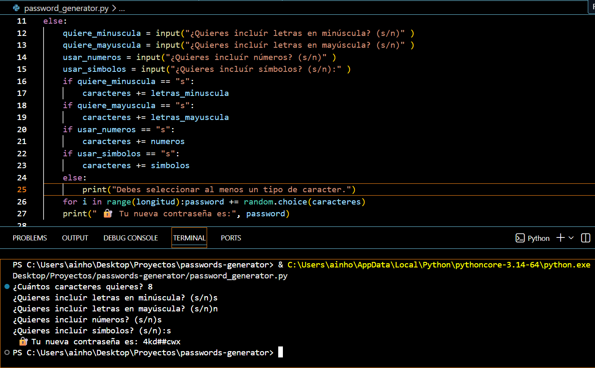

#  🔐 Password Generator
This is my first Python project.
A simple command-line application that generates customizable passwords based on user preferences.

## Screenshot


## Features
- Custom password length.
- Optional lowercase letters.
- Optional uppercase letters.
- Optional numbers.
- Optional symbols.
- Minimum password length validation.

## Technologies
- Python 3

## Requirements
- Python 3.10 or later

## How to run
```bash 
python password_generator.py
```

## What I learned
- Variables
- User input (`input()`)
- Conditional statements (`if` / `else`)
- Loops (`for`)
- Random module
- String manipulation
- Basic debugging

## Future improvements
- Guarantee at least one character of each selected type.
- Improve input validation.
- Refactor the code using functions.

## Example
```text
Length: 12
Include lowercase: Yes
Include uppercase: Yes
Include numbers: Yes
Include symbols: Yes
Output:
A9!dkP3@qLm$
```
